# qnap-nextcloud

## Requirements

- Latest QNAP Firmware Installed.
- Container Station Installed & Updated.
- Understand how to access your QNAP via SSH.  [Access my QNAP NAS using SSH](https://www.qnap.com/en/how-to/knowledge-base/article/how-do-i-access-my-qnap-nas-using-ssh)

## User Creation
Create a new user which will be used for docker containers, so that they are not running as root (primarily for security reasons). 
Go to "Users" from the main screen QTS, select "Create User" and create a user called "dockeruser"

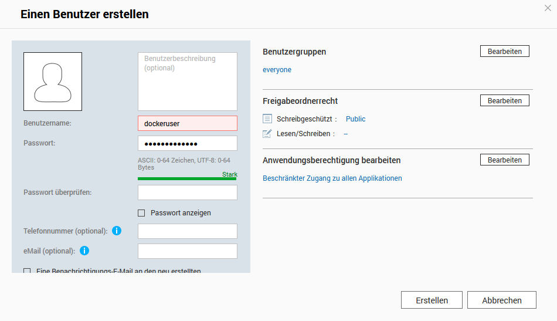


## Folder Creation
Create a new shared folder that we will keep all docker appdata in. Load up "File Station" and create a new share by clicking on the `+` next to the Data Volume.

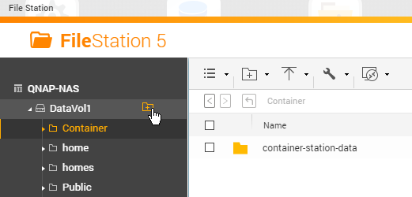

Call the folder `Docker` and give full read/write access to this folder to the newly created `dockeruser`. Everything else can be left as default.

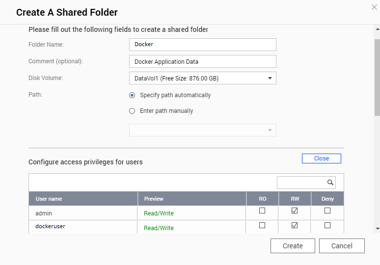

Once the `Docker` folder is created, create another folder called `nextcloud` within the `Docker` folder.


## Get User IDs
Now the UID/GID of the user `dockeruser` need to be figured out. Use your favourite method to ssh into the QNAP NAS and run the following command:

```console
id <username>
```

Replace <username> with the user you created earlier (dockeruser). The result of the command should look like this:

Result:
```console
[~] # id dockeruser
uid=500(dockeruser) gid=100(everyone) groups=100(everyone)
[~] #
```

Note the UID and the GID and replace the ID's in the docker-compose.yml file (see comments in the docker-compose file).


## Container Creation
Create a new container based on the docker-compose.yml file.

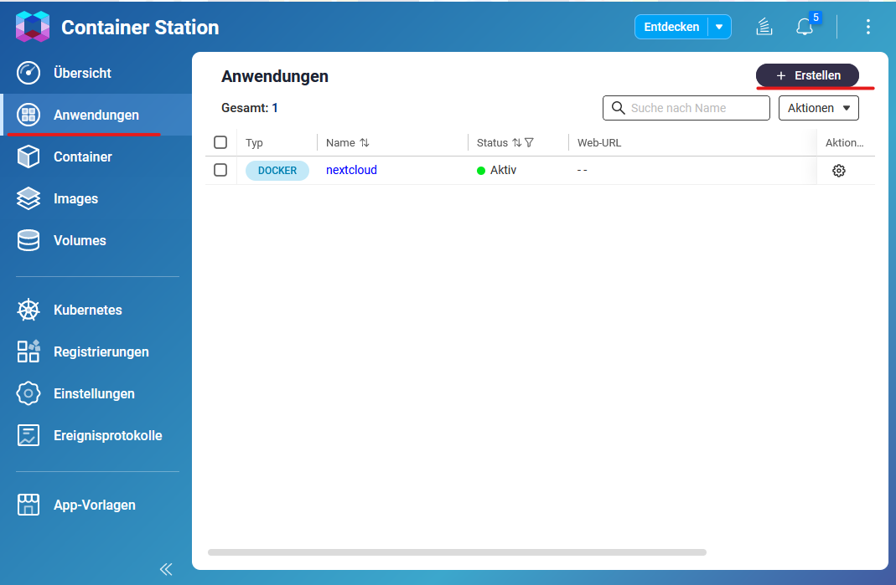

Open the `Container Station` and select `Create` from the management menu. Click on the `Create Application` button.

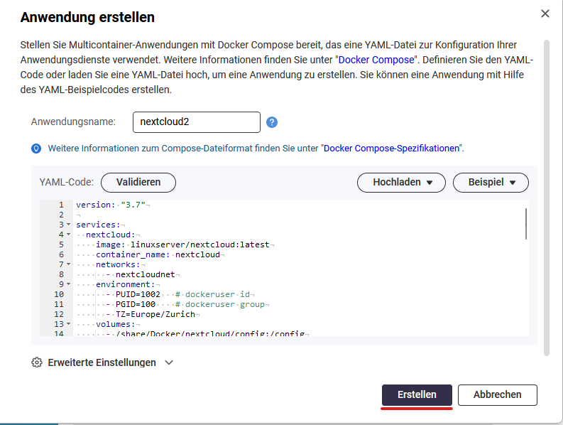

Download the docker-compose.yml from the repository and replace the passwords and the dockeruser id/group (see comments in the docker-compose file).

Choose a name for the Container and paste the content of the docker-compose.yml into the YAML section and click on the create button.

## Setup Nextcloud 
After the container is created, open the Nextcloud web interface on https://NAS-IP:9443/

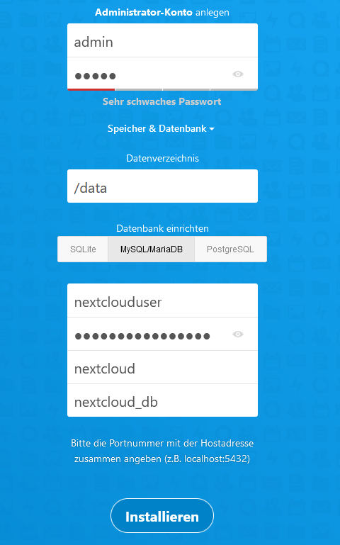

Fill in the credentials for the administrator account.

Select MySQL/MariaDB as database and use the database credentials defined in the docker-compose.yml file.
(MYSQL_USER, MYSQL_PASSWORD, MYSQL_DATABASE, container_name)

Click `Install` to finish the Nextcloud setup.

## Update Container
To keep everything up to date the containers and the Nextcloud installation have to be updated.

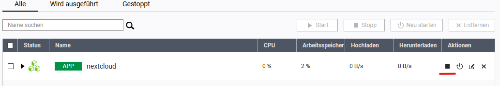

Stop the running Nextcloud container.

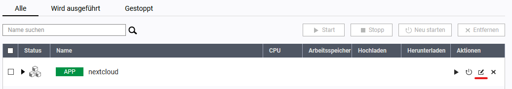

Press on `edit` and copy the docker-compose file of the Nextcloud container (which contains the actual passwords, user Id, user group).

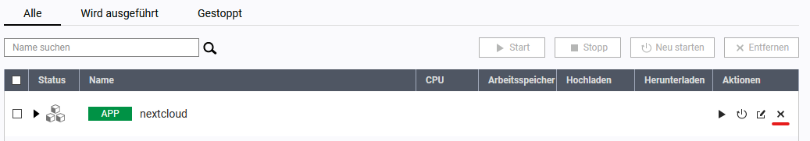

Press on `delete` to delete the existing Container (Alle user specific data is stored outside of the container).

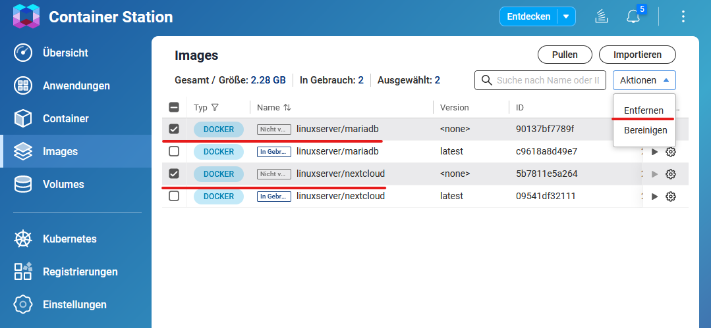

Select `Images` from the management menu and remove the images linuxserver/nextcloud and linuxserver/mariadb.


Select `Create` from the management menu. Click on the `Create Application` button.


Choose a name for the Container and paste the previously copied docker-compose file into the YAML section and click on the create button.

After the container is created, it uses the latest images.

## Update Nextcloud
To update Nextcloud, it is not possible to do so directly from the web interface. Instead, the update process involves pulling the new image and recreating the container with it. When the container starts up, it automatically detects if an update is required and performs it accordingly.

It's important to note that Nextcloud can only be upgraded one major version at a time. For example, if you want to upgrade from version 26 to 28, you will first need to upgrade from version 26 to 27, and then from 27 to 28. In such cases, you will need to recreate the container with a specific version tag instead of using the latest tag. Once you have reached the latest major version, you can switch back to using the latest tag for updates.


## Migrate to Container Station 3
Starting from Container Station 3, it is no longer possible to set resource limits directly within the docker-compose file. 
As a result, it is important to remove all deploy sections from the docker-compose file to ensure that the containers start successfully.

```yaml
# remove this section 
    deploy:
      resources:
        limits:
          cpus: 1.20
          memory: 4096M
```
Resource limits can be manually configured in the advanced settings. This allows you to define specific limits for CPU usage and memory allocation.

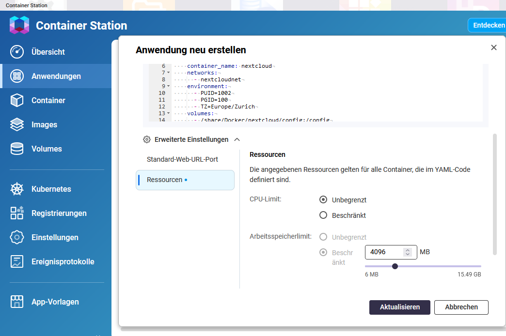

# Links
- [Access my QNAP NAS using SSH](https://www.qnap.com/en/how-to/knowledge-base/article/how-do-i-access-my-qnap-nas-using-ssh)
- [Setup QNAP user for Docker containers](https://www.linuxserver.io/blog/2017-09-17-how-to-setup-containers-on-qnap)
- [How to use Container Station](https://www.qnap.com/en/how-to/tutorial/article/how-to-use-container-station)
- [Update Nextcloud](https://docs.linuxserver.io/images/docker-nextcloud/#updating-nextcloud)
- [Blog post regarding Nextcloud updates with linuxserver/nextcloud container](https://discourse.linuxserver.io/t/upgrading-nextcloud/400)
- [Container documentation linuxserver/nextcloud](https://docs.linuxserver.io/images/docker-nextcloud)
- [Container documentation linuxserver/mariadb](https://docs.linuxserver.io/images/docker-mariadb)
